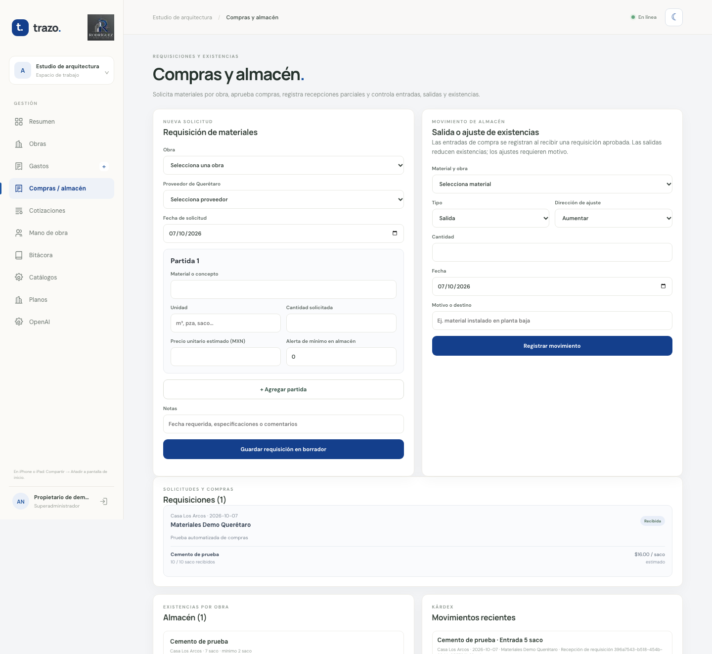

<section class="hero">
  

    
<strong>RODRÍGUEZ ARQUITECTOS · GUÍA DEL PROPIETARIO</strong>

    <h1>Administra tus obras con Trazo</h1>
    
Aprende a registrar proyectos, revisar gastos, preparar cotizaciones y organizar al equipo desde computadora o celular.

    <a class="button-link" href="https://arqui.cj-iap.org">Abrir Trazo</a>
    <a class="button-link secondary" href="#primeros-pasos">Empezar la guía</a>
  

  
</section>

> Las capturas de esta guía usan información ficticia. No incluyas contraseñas, planos privados ni datos reales de clientes en solicitudes de soporte.

## Vista general

  <figure class="screen-card">
    
    <figcaption>Acceso de Trazo con el logotipo y la paleta azul y grafito del despacho.</figcaption>
  </figure>
  <figure class="screen-card">
    
    <figcaption>Resumen de demostración con indicadores de presupuesto, gasto y avance.</figcaption>
  </figure>
  <figure class="screen-card">
    
    <figcaption>Vista adaptable para el uso diario desde un teléfono.</figcaption>
  </figure>
  <figure class="screen-card">
    
    <figcaption>Cotizaciones versionadas y desglose de conceptos.</figcaption>
  </figure>
  <figure class="screen-card">
    
    <figcaption>Registro de jornadas, destajos, raya y pagos semanales.</figcaption>
  </figure>
  <figure class="screen-card">
    
    <figcaption>Notas y evidencia para documentar el trabajo en obra.</figcaption>
  </figure>
  <figure class="screen-card">
    
    <figcaption>Proveedores, productos y actualización semestral de precios.</figcaption>
  </figure>
  <figure class="screen-card">
    
    <figcaption>Requisiciones, recepción parcial, existencias por obra y kárdex.</figcaption>
  </figure>
  <figure class="screen-card">
    
    <figcaption>El módulo se adapta a pantallas pequeñas; la navegación móvil permanece accesible.</figcaption>
  </figure>
  <figure class="screen-card">
    
    <figcaption>Anticipos, estimaciones, cobros y saldos pendientes por obra.</figcaption>
  </figure>
  <figure class="screen-card">
    
    <figcaption>Consulta de saldos y registro de pagos desde el teléfono.</figcaption>
  </figure>
  <figure class="screen-card">
    
    <figcaption>Expediente de planos y cantidades preliminares que requieren validación.</figcaption>
  </figure>
  <figure class="screen-card">
    
    <figcaption>El tema oscuro conserva el branding para trabajar con poca luz.</figcaption>
  </figure>

## Primeros pasos {#primeros-pasos}

1. Abre [Trazo](https://arqui.cj-iap.org) y entra con el correo y contraseña temporal que te entregó el administrador.
2. En el primer acceso, crea una contraseña personal de al menos 14 caracteres. No la reutilices en otros servicios.
3. Si no recuerdas la contraseña, usa **¿Olvidaste tu contraseña?** en la pantalla de acceso. Abre el enlace recibido en tu correo; vence en 60 minutos y solo se puede usar una vez.
4. Elige el tema claro u oscuro con el control de tema. La preferencia queda guardada en ese navegador.
5. Instala la PWA en el celular para abrirla como aplicación. La primera instalación y la sincronización necesitan internet y HTTPS:
   - **iPhone/iPad:** abre Trazo en Safari → **Compartir** → **Añadir a pantalla de inicio**.
   - **Android:** abre Trazo en Chrome → menú **⋮** → **Instalar aplicación** o **Añadir a pantalla de inicio**.

## Operación diaria

### 1. Crear y revisar obras

En **Obras**, registra nombre, cliente, ubicación, tipo de proyecto (proyecto ejecutivo, construcción o remodelación), presupuesto autorizado, fechas y avance. El tablero muestra el presupuesto, los gastos y el porcentaje de avance; presenta una alerta al alcanzar el 90 % del presupuesto. Mantén las fechas y el avance actualizados.

### 2. Registrar gastos y comprobantes

En **Gastos**, selecciona la obra, categoría, concepto, proveedor, fecha, importe, forma de pago y estado de factura. Desde el teléfono, **Agregar foto del ticket** permite tomar o elegir una fotografía JPG, PNG o WebP de hasta 5 MB. Revisa que el gasto aparezca en la lista después de guardarlo.

**Sin señal:** los gastos y sus fotografías pueden quedar en la cola local del dispositivo y sincronizarse cuando vuelva la conexión. Abre la PWA mientras tengas señal antes de ir a la obra; confirma que los pendientes se hayan enviado antes de cerrar sesión o borrar los datos del navegador. Las demás operaciones requieren conexión.

### 3. Preparar cotizaciones

En **Cotizaciones**, elige la obra. En **Agregar cuantificación desde planos**, selecciona una medición previamente guardada en **Planos**. Para muros de block, tabique o tabicón, Trazo propone las piezas calculadas con el coeficiente y desperdicio registrados; puedes elegir una referencia de precio por pieza del catálogo. Si la medición incluye productividad, puedes añadir también jornadas con el jornal de un trabajador activo. La referencia de proveedor/fecha y los supuestos de cálculo quedan guardados en el desglose interno de la partida.

Las cantidades y tarifas son preliminares: comprueba cota, huecos, coeficiente, desperdicio, vigencia del precio, cuadrilla y condiciones reales. Sin precio de catálogo, captura el precio unitario antes de guardar. Después agrega o edita las partidas necesarias y captura los porcentajes de indirectos, utilidad e IVA. Guarda una revisión para conservar versiones. El arquitecto controla los estados: marca **Enviada** cuando comparta la propuesta fuera de Trazo y **Aprobada** cuando autorice internamente ese presupuesto como base de obra. No hay portal ni aprobación del cliente dentro de la app. Usa la opción de impresión del navegador y **Guardar como PDF** para conservar o compartir el documento con el logotipo.

### 4. Mano de obra y raya

En **Mano de obra**, registra cada trabajador con oficio y jornal. Captura jornadas por obra, días trabajados, destajos y anticipos. Revisa la semana correspondiente y registra el pago por trabajador, importe y referencia/nota. La pantalla calcula el monto a pagar con base en los registros disponibles; coteja la información con el control de asistencia del despacho antes de pagar.

### 5. Bitácora

En **Bitácora**, agrega una nota fechada, obra, título, descripción y evidencia fotográfica opcional. En un teléfono, permite el acceso a cámara. Si el navegador solicita ubicación, autorízala solo para adjuntar coordenadas; la ubicación es opcional. Las fotos y coordenadas son información privada de la obra.

### 6. Proveedores, insumos y precios

En **Catálogos**, agrega proveedores del estado de Querétaro y asocia cada insumo o servicio con unidad, precio de referencia, fecha y tipo de fuente. El historial conserva las actualizaciones anteriores.

Cada seis meses:

1. Descarga **Catálogo actual (.csv)** para partir de los proveedores y precios guardados, o **Plantilla vacía** para capturar registros nuevos.
2. Ábrelo en Excel o Google Sheets y registra una fila por proveedor y producto/servicio. Conserva los 13 encabezados, los nombres de municipios de Querétaro y las fechas `AAAA-MM-DD`.
3. Incluye el tipo de elemento (**Insumo** o **Concepto**), unidad, precio en MXN y fuente. Si eliges **Precio publicado**, agrega una URL HTTPS.
4. Guarda/exporta como CSV UTF-8 y pulsa **Subir catálogo actualizado**.
5. Revisa el resumen de importación y corrige las filas señaladas. Un precio repetido para el mismo proveedor, producto, fecha e importe no duplica el historial.

Ejemplos de registros manuales: arena, grava, tepetate, camiones de volteo, viajes de escombro y renta de retroexcavadora por día u hora. No se buscarán estos precios en páginas web, porque son servicios y precios locales que requieren cotización directa.

**Precios web:** el catálogo ya permite guardar un precio publicado con enlace a su fuente; las sugerencias actuales de Trazo usan precios que el despacho verificó y capturó durante los últimos seis meses. Los más antiguos no se proponen como vigentes. La consulta automática de publicaciones de proveedores de Querétaro aún no está habilitada. Se conserva como evolución para materiales con precio público; nunca debe sustituir cotizaciones locales ni inventar precios.

### 7. Compras y almacén

En **Compras / almacén**, crea una requisición por obra y agrega materiales, unidades, cantidades y, si se conoce, un precio de referencia. En cada borrador o solicitud abre **Agregar cotización o precio de referencia** para capturar una oferta completa por proveedor, con fecha, fuente, precios unitarios, flete/otros cargos y folio. Se pueden registrar varias ofertas y comparar el total del pedido y sus precios por partida. Elige la oferta que autorizará el arquitecto y envía la requisición a revisión; solo entonces queda habilitada **Autorizar compra**. El propietario/arquitecto es quien aprueba; no hay aprobación del cliente.

Una opción **Precio publicado** permite guardar manualmente el precio consultado en internet y su URL como evidencia. Trazo no busca ni actualiza esos precios automáticamente: verifica la fecha, vigencia, disponibilidad, flete e impuestos antes de seleccionar una oferta. Al recibir al proveedor elegido, captura la cantidad real, costo, fecha y forma de pago. La recepción puede hacerse en varias entregas; cada una crea el gasto de materiales y la entrada de existencias correspondientes.

La sección de **Solicitudes y compras** muestra el estado y las cantidades recibidas de cada partida. En **Almacén** consulta existencias por obra y niveles mínimos; **Kárdex** muestra las entradas y salidas recientes. Para registrar consumo, selecciona material/obra, tipo **Salida**, cantidad, fecha y destino o motivo. Los ajustes requieren motivo y el sistema rechaza movimientos que dejen una existencia negativa. Solo la captura de gastos tiene cola sin conexión; requisiciones y movimientos de almacén requieren conexión.

### 8. Cobranza de clientes

En **Cobranza**, registra un anticipo, estimación, finiquito u otro cargo para una obra, con concepto, importe, fecha de emisión y vencimiento. Si eliges una cotización aprobada, puedes dividir su total en cuentas (por ejemplo, anticipo y estimaciones); Trazo impide asignar más que el importe aprobado. Los cargos no asociados a una cotización pueden usarse para registrar otros acuerdos autorizados.

Abre **Registrar abono** en una cuenta pendiente para guardar importe, fecha, forma de pago y referencia/folio. Se permiten pagos parciales; Trazo valida el saldo restante y conserva el historial. El resumen por obra muestra lo cobrado y pendiente; el módulo señala cuentas vencidas y permite descargar el reporte como CSV para abrirlo en Excel. La cobranza no es una factura fiscal ni sustituye la conciliación bancaria.

### 9. Planos y cuantificación preliminar

En **Planos**, selecciona una obra y adjunta una fotografía desde el celular (la cámara trasera se ofrece como opción) o un PDF acotado. Captura manualmente longitud, altura y área de huecos. Trazo calcula el área neta y unidades aproximadas con un coeficiente editable; puede calcular persona-días si se registra productividad. Asocia la medición al documento y revisa los resultados antes de usarlos. En **Cotizaciones**, elige esa medición para proponer una partida de piezas de muro; si se selecciona una referencia, se guardan el proveedor y fecha del precio, y la tarifa/rendimiento de mano de obra registrados. No es un cálculo estructural ni una cuantificación integral.

La lectura opcional con OpenAI requiere configurar una API key de OpenAI Platform y confirmar cada envío. Solo se envía el plano elegido; la respuesta puede proponer cotas explícitas legibles, no se guarda automáticamente y debe validarla una persona. El uso de API se cobra por separado de una suscripción ChatGPT.

### 10. Recuperar acceso y proteger información

Los enlaces de recuperación son de un solo uso y vencen en 60 minutos. No compartas enlaces de recuperación, contraseñas o claves de OpenAI. Si cambias de teléfono, inicia sesión desde un dispositivo confiable y consulta al administrador antes de borrar los datos locales si hay gastos pendientes.

## Funciones de la propuesta integral y estado de Trazo

La propuesta describe un sistema integral con 20 áreas. Este manual las incluye para orientar el alcance y la evolución, pero no todas están implementadas en la aplicación actual. **Disponible** indica que el flujo está operativo; **Parcial** indica que existe una base, pero faltan funciones importantes; **Pendiente** significa que el módulo aún no está implementado; **Fuera de alcance** indica que el propietario confirmó que no requiere esa función.

| # | Funcionalidad solicitada en el PDF | Estado | Cobertura actual / límite principal |
| --- | --- | --- | --- |
| 1 | Obras y expediente integral | Parcial | Alta de obra y expediente de planos; faltan código único, responsables y expediente completo. |
| 2 | Planos, cuantificación y presupuesto | Parcial | Medición preliminar de algunos muros; puede insertar sus piezas en una cotización, pero no cuantifica toda la obra ni la genera automáticamente. |
| 3 | Presupuestos profesionales y versiones | Parcial | Cotizaciones versionadas con partidas y porcentajes; faltan análisis completos de rendimientos y costos. |
| 4 | Explosión de insumos | Parcial | Inserta piezas de algunos muros y, opcionalmente, mano de obra; no calcula todos los insumos ni controla requerido, comprado, recibido y consumido. |
| 5 | Requisiciones, compras y proveedores | Parcial | Requisiciones por obra, comparativo de ofertas/precios, selección y autorización del arquitecto, recepción parcial y gasto automático; faltan seguimiento de entrega y evaluación de proveedor. |
| 6 | Almacén por obra | Parcial | Entradas, salidas, ajustes, existencias por obra, kardex y mínimos; faltan devoluciones, traspasos y conciliación física. |
| 7 | Personal, asistencia y nómina | Parcial | Jornadas, raya, anticipos y pagos; falta asistencia e incidencias de nómina completas. |
| 8 | Destajos y contratistas | Fuera de alcance | El propietario no requiere un módulo de contratistas; se conserva la captura básica de destajos y pagos semanales en Mano de obra. |
| 9 | Programa y avance | Parcial | Avance general y fechas; no hay Gantt ni comparación planeado vs. real. |
| 10 | Bitácora digital | Parcial | Notas, fotos y ubicación opcional; faltan reportes y campos operativos adicionales. |
| 11 | Control financiero | Parcial | Presupuesto, gastos, cuentas por cobrar, abonos, saldos y vencidos; faltan comprometidos, cuentas por pagar y utilidad real. |
| 12 | Trabajos extraordinarios | Pendiente | No existe flujo de órdenes de cambio. |
| 13 | Atención y cobranza de clientes | Parcial | Cliente en obra, cuentas por cobrar y pagos; faltan CRM, seguimiento y recordatorios. |
| 14 | Reportes automáticos | Parcial | Cotización imprimible y cobranza exportable a CSV; faltan reportes ejecutivos integrales. |
| 15 | Tablero directivo | Parcial | Presupuesto, gasto, avance, vencidos y resumen de cobranza; faltan indicadores financieros avanzados. |
| 16 | Indirectos y gastos generales | Parcial | Porcentajes de cotización y gastos; falta el control integral de indirectos. |
| 17 | Inteligencia artificial | Parcial | Lectura preliminar de cotas; no genera presupuesto, explosión ni decisiones autónomas. |
| 18 | Flujo de obra integrado | Parcial | Módulos operativos separados; no hay un proceso integral automatizado. |
| 19 | Cuantificación desde proyectos técnicos | Parcial | Requiere cotas legibles y validación humana; no calcula estructura ni instalaciones. |
| 20 | Información capturada una sola vez | Parcial | Registros asociados a obras; los módulos no alimentan automáticamente todo el ciclo financiero. |

Los datos de prueba que aparecen en las capturas son ficticios. Los precios, cantidades y mediciones deben validarse con proveedores, planos y responsables de obra. El criterio técnico final siempre corresponde al arquitecto.

## Ayuda

Si un cambio de catálogo muestra errores, usa el número de fila y el mensaje para corregir el CSV; conserva una copia del archivo antes de editarlo. Para datos de acceso, SMTP, respaldos o recuperación de una cuenta, contacta al administrador del sistema. No publiques en GitHub Pages bases SQLite, recibos, planos, contraseñas, enlaces de recuperación ni archivos `.env`.
